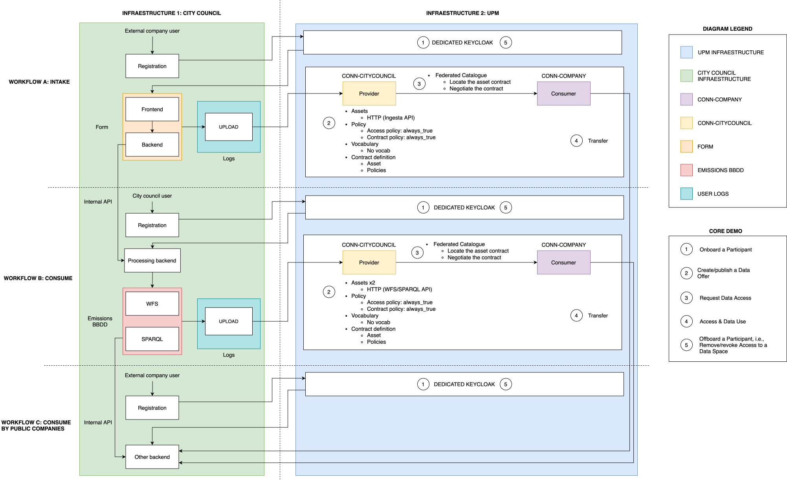

# Architecture

## Purpose

This document is the canonical description of the current IPPCP automation architecture. It defines the logical actors, control and data flows, version status, and security boundaries without prescribing a deployment topology.

Detailed authentication behavior is maintained in [Authentication](authentication.md). Script-level phase behavior is maintained in [Execution phases](execution-phases.md).

## Status vocabulary

The documentation uses these terms consistently:

- **Current and recommended:** the `v2` `HttpData-PULL` execution path for new integrations.
- **Validated:** behavior demonstrated end-to-end with a materialized phase 4 download and verified manifest.
- **Legacy-supported and not recommended:** `v1` project material retained for compatibility.
- **Delivered baseline evidence:** the B2/CSV/InesDataStore T1 evidence. It is preserved as an accepted delivery baseline but is not the recommended current integration.
- **Historical or obsolete:** `test3`, discarded experiments, the upstream JWT approach, and old workshop procedures.
- **Planned:** future backend services, persistent orchestration state, API contracts, callbacks, and deployment topology.

Version status and evidence status are separate. A delivered evidence baseline does not make its workflow the recommended architecture.

## Architecture diagram

[](diagrams/ippcp-architecture.svg)

[Open the editable Draw.io source](diagrams/ippcp-architecture.drawio). The status classifications in this document remain authoritative for current, validated, legacy-supported, and planned components.

### Diagram scope and terminology

- `DEDICATED KEYCLOAK` is the municipal application Keycloak used by the City Council platform and external users. It is currently hosted temporarily in UPM infrastructure.
- The municipal application Keycloak is separate from the EdD Keycloak that authenticates the provider and consumer connector users.
- The dotted partitions separate functional phases and infrastructure domains.
- `WORKFLOW A` through `WORKFLOW C` are business and use-case stages. They are distinct from the technical `phase0` through `phase4` script pipeline.
- The diagram is intentionally a high-level functional and infrastructure view, not an exhaustive low-level EDC sequence. Data Plane and EDR behavior, `X-Api-Key` and `X-Provider-Id`, `run_id`/`SUFFIX`, and evidence mechanics remain documented in [Authentication](authentication.md), [Execution phases](execution-phases.md), and [Evidence and traceability](evidence-and-traceability.md).

## Current logical actors

### Operator and Bash automation

The current implementation is a set of Bash phase scripts. The operator selects a dataspace, flow, and version, then executes `phase0` through `phase4`. The scripts load configuration, invoke connector APIs, and persist local runtime state and evidence.

No provider or consumer backend API is implemented in this repository. Backend components described later are future integration boundaries.

### Provider connector

The provider connector:

- authenticates a provider technical user against the EdD Keycloak service;
- publishes vocabularies, policies, assets, data addresses, and contract definitions;
- exposes the provider catalog;
- owns the upstream data address and any provider-side upstream secret.

For current `v2` flows, the city-council connector is the provider.

### Consumer connector

The consumer connector:

- authenticates a consumer technical user against the EdD Keycloak service;
- requests the provider catalog;
- starts and monitors contract negotiation;
- obtains the contract agreement;
- starts and monitors the transfer process;
- retrieves the Endpoint Data Reference (EDR).

For current `v2` flows, the company connector is the consumer.

### Data Plane

The Data Plane is responsible for material data delivery after contract negotiation and transfer setup. The consumer uses the EDR to reach the Data Plane. The Data Plane then resolves the provider asset data address and accesses the upstream resource.

The EDR credential and any upstream credential protect different network hops. They are not interchangeable.

### Upstream resources

Current public flows publish these upstream resource types:

- **Ingestion API:** protected HTTP resource using `X-Api-Key` and `X-Provider-Id`.
- **WFS:** HTTP WFS resource published as `HttpData-PULL`.
- **SPARQL:** HTTP SPARQL resource published as `HttpData-PULL`, with the required response format fixed by the canonical asset configuration.

Canonical public documentation must use endpoint placeholders or environment variables. Concrete PRE or POST connector hosts are environment-specific and are not architecture requirements.

## Current flow selection

The dataspace configuration selects the logical environment. The recommended flow version is:

```text
IPPCP_FLOW_VERSION=v2
```

Current flow names are:

```text
IPPCP_FLOW=ingesta   # Ingestion API
IPPCP_FLOW=consumo   # WFS or SPARQL
```

The selected flow directory supplies non-secret provider and consumer connector configuration. Local ignored files supply connector credentials. Asset configuration selects the upstream resource.

Flow-specific differences are documented in:

- [Ingestion API](flows/ingestion-api.md)
- [WFS](flows/wfs.md)
- [SPARQL](flows/sparql.md)

## Control flow

The current control flow is:

1. Resolve dataspace, version, flow, and connector configuration.
2. Authenticate provider and consumer technical users against EdD Keycloak.
3. Publish the provider-side asset and contract definition.
4. Discover the asset through the consumer connector.
5. Negotiate a contract and obtain the agreement.
6. Start the transfer process.
7. Retrieve an EDR from the consumer connector.
8. Use the EDR to consume and verify the data.

The phase mapping is:

```text
phase0 -> phase1 -> phase2 -> phase3 -> phase4
```

See [Execution phases](execution-phases.md) for inputs, outputs, artifacts, and runnable commands.

## Data flow

The control plane does not carry the business payload between the provider and consumer scripts.

The material data flow is:

1. The consumer obtains an EDR after transfer initiation.
2. Phase 4 retrieves a current EDR at runtime.
3. Phase 4 calls the Data Plane with the EDR credential.
4. The Data Plane reads the provider asset data address.
5. The Data Plane calls the upstream resource.
6. The response returns through the Data Plane to the consumer-side execution.
7. Phase 4 stores the download, manifest, and SHA-256 hash.

For the Ingestion API, the API key remains provider-side in the asset data address. The consumer and its future backend do not receive it.

## Management API endpoint composition

Connector base URLs come from the selected dataspace and flow configuration. Effective Management API URLs are composed from:

```text
connector base URL + operation path
```

[`endpoints.sh`](../endpoints.sh) is the canonical source only for the relative operation paths actually declared there:

- asset request;
- policy-definition request;
- contract-definition request;
- contract-agreement request;
- transfer-process request;
- vocabulary request.

The current scripts do not centralize every operation in `endpoints.sh`:

- catalog operations are defined in the phase 1 and phase 2 scripts;
- contract-negotiation create and state operations are defined in phase 2;
- contract-agreement item retrieval is defined in phase 2;
- transfer creation and state retrieval are defined in phase 3;
- EDR direct retrieval and fallback request operations are defined in phases 3 and 4;
- asset, policy, vocabulary, and contract-definition create/item operations are defined in phase 1.

This is a path-centralization gap in the current implementation. Documentation references the owning script for operations not represented in `endpoints.sh`; Phase 2 does not invent, duplicate, or relocate those paths.

## Security boundaries

### EdD management boundary

Provider and consumer technical users use short-lived EdD JWTs for connector Management API operations. Their passwords and JWTs remain local.

### Provider upstream boundary

The Ingestion API uses a provider-side API key and provider identifier stored in the asset data address. The API key is persisted in the provider connector for the assessment and must be treated as a secret.

### EDR boundary

The EDR credential authorizes Data Plane consumption. It is obtained by the consumer side after transfer initiation and must not be exposed in evidence or transferred as provider configuration.

The full credential ownership and persistence rules are defined in [Authentication](authentication.md).

## Current, validated, legacy, and planned components

### Current

- `v2` flow resolution.
- Provider and consumer connector Management API operations.
- `HttpData-PULL` publication for Ingestion API, WFS, and SPARQL.
- Phase environment hand-off.
- Local `summary.json`, evidence, downloads, manifests, and hashes.

### Validated

- Current Ingestion API execution completed end-to-end in PRE.
- WFS and SPARQL executions completed with verified phase 4 outputs.

Concrete validation identifiers and hashes remain internal unless explicitly sanitized and approved.

### Legacy-supported

- `v1` project configuration and documentation.

### Delivered baseline

- T1 B2/CSV/InesDataStore evidence is preserved as a delivered baseline. It is not replaced by the additional T4 Ingestion API validation.

### Historical or obsolete

- `test3`;
- discarded experimental asset configurations;
- upstream JWT authentication for the Ingestion API;
- old workshop procedures.

### Planned

- provider and consumer backend services;
- a database-backed execution state replacing shell env hand-offs;
- backend API payloads and callbacks;
- automated onboarding, offboarding, revocation, and credential rotation;
- additional deployment-specific and network-specific topology diagrams.

Planned components must not be presented as implemented or validated.

## Related documentation

- [Authentication](authentication.md)
- [Execution phases](execution-phases.md)
- [Backend integration](backend-integration.md)
- [Evidence and traceability](evidence-and-traceability.md)
