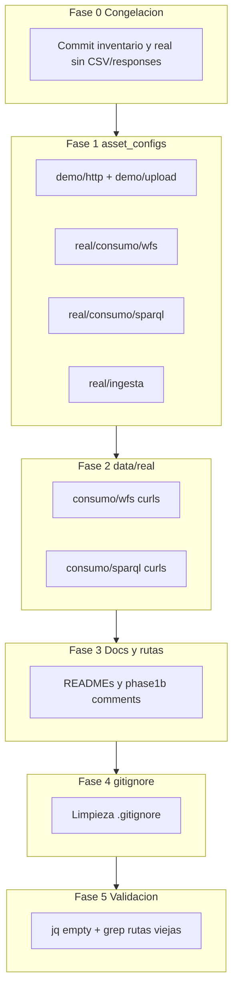

# Plan de limpieza del repositorio IPPCP API

Plan ejecutable de limpieza y reorganización del repositorio, basado en el inventario previo documentado en [`docs/repo_inventory.md`](repo_inventory.md).

**Fecha:** 2026-06-19  
**Estado:** planificación — ninguna fase ejecutada aún.

---

## 1. Objetivo

Reorganizar el repositorio IPPCP API para separar claramente:

```text
examples
demo
real
consumo
ingesta
WFS
SPARQL
runtime/generated
```

Mantener **fuera de Git** los artefactos generados o sensibles:

```text
responses/
downloads/
evidencias/runs/
phase*_env.sh
phase*_env.sh.bak.*
*.sensitive.json
*.secret.json
```

**Política provisional del CSV real (4.3M):**

```text
No versionar data/real/ingesta/BBDD_Residencial_2021.csv hasta confirmación explícita.
```

El config B2 puede seguir apuntando a esa ruta local; la documentación debe indicar que el fichero debe colocarse manualmente en el clone.

---

## 2. Principios de reorganización

- Usar **`git mv`** para ficheros ya trackeados por Git (preserva historial).
- **No usar symlinks** salvo decisión explícita posterior.
- **`data/real/consumo/responses/`** permanece generado e ignorado; no entra en commits.
- El **CSV real no se versiona** provisionalmente.
- El config B2 mantiene:

  ```text
  local_file: data/real/ingesta/BBDD_Residencial_2021.csv
  ```

- **No mover** scripts de automatización en `scripts/`.
- Solo actualizar referencias, documentación y comentarios cuando proceda (Fase 3).
- **Separar credenciales de exports de flujo** — hecho: `flujos/<flujo>/export_*.sh` (versionados) + `user_*.sh` locales ignorados + plantillas `user_*.example.sh`.

### Precondición crítica para Fases 1 y 2

Los comandos `git mv` de las fases posteriores **solo deben ejecutarse después de la Fase 0**, cuando los ficheros actualmente untracked ya estén trackeados por Git.

Ahora mismo pueden estar sin trackear:

```text
asset_configs/real/
data/real/
docs/repo_inventory.md
```

Si un fichero no está en Git, `git mv` fallará. Verificar siempre con:

```bash
git ls-files --error-unmatch asset_configs/real/emisiones_wfs_juntas_geojson.json
git ls-files --error-unmatch data/real/consumo/curl_wfs_juntas_geojson.sh
```

Si esos comandos fallan, **no ejecutar `git mv`**; completar primero el commit de congelación (Fase 0).

---

## 3. Decisiones pendientes

| Decisión | Estado provisional | Acción en plan |
| -------- | -------------------- | -------------- |
| Versionar `BBDD_Residencial_2021.csv` | No | Proponer `data/real/ingesta/*.csv` en `.gitignore`; README documenta colocación local |
| Eliminar `asset_configs/upload/` vacío | Pendiente post-Fase 1 | `rmdir` si queda vacío |
| Symlinks de compatibilidad | No | Sin alias en rutas antiguas |
| Test funcional B1 post-limpieza | Opcional | Solo en ejecución controlada `phase0→phase4` |
| Commit Fase 0 | Manual | Comandos propuestos, sin auto-ejecución |

---

## 4. Estructura objetivo

### `asset_configs/`

```text
asset_configs/
  examples/
    emisiones_wfs.example.json
    emisiones_sparql.example.json
    emisiones_csv.example.json
    emisiones_wfs_gml.example.json
    ingesta_excel.example.json
    ingesta_csv_upload.example.json

  demo/
    http/
      http_jsonplaceholder_todos.json
      test_csv_public.json
    upload/
      ingesta_csv_empresa_demo.json

  real/
    consumo/
      wfs/
        emisiones_wfs_juntas_geojson.json
        emisiones_wfs_ciudad_geojson.json
      sparql/
        emisiones_sparql_limit10.json
        emisiones_sparql_limit10_format_json.json
        emisiones_sparql_grafo_emisiones_pending.json
    ingesta/
      ingesta_bbdd_residencial_2021_csv.json
      ingesta_api_tentativa.pending.json
```

### `data/real/`

```text
data/
  real/
    consumo/
      README.md
      wfs/
        curl_wfs_juntas_geojson.sh
        curl_wfs_ciudad_geojson.sh
      sparql/
        curl_sparql_limit10.sh
        curl_sparql_limit10_no_accept.sh
        curl_sparql_limit10_format_mime.sh
        curl_sparql_limit10_format_json.sh
        curl_sparql_limit10_output_json.sh
        curl_sparql_grafo_emisiones_pending.sh
        test_sparql_format_variants.sh
      responses/        # generado, ignorado
    ingesta/
      README.md         # opcional; documentar CSV local
      BBDD_Residencial_2021.csv   # local, no versionado salvo decisión explícita
    README.md
```

**Nota:** `data/real/consumo/responses/` sigue siendo **generado e ignorado**; no se mueve ni se versiona.

### Diagrama de fases



---

## 5. Fase 0 — Commit de congelación

**Esta fase debe ejecutarse antes de cualquier `git mv`.**

### Incluir en el commit

```text
.gitignore
README.md
scripts/README.md
docs/repo_inventory.md
asset_configs/real/
data/real/README.md
data/real/consumo/
```

### Excluir explícitamente

```text
data/real/ingesta/BBDD_Residencial_2021.csv
data/real/consumo/responses/
downloads/
evidencias/
phase*_env.sh
phase*_env.sh.bak.*
*.sensitive.json
*.secret.json
```

### Comandos propuestos (no ejecutados automáticamente)

```bash
git status --short
git add .gitignore README.md scripts/README.md docs/repo_inventory.md asset_configs/real data/real/README.md data/real/consumo
git status --short
git diff --cached --name-only
```

**Mensaje de commit sugerido:**

```text
Add real IPPCP asset configs and repository inventory
```

**Nota:** `git add data/real/consumo` no debe incluir `responses/` si `.gitignore` está correcto. Verificar con `git diff --cached --name-only` antes de commitear.

---

## 6. Fase 1 — Reorganización de asset_configs

### Precondición

```bash
git ls-files --error-unmatch asset_configs/real/emisiones_wfs_juntas_geojson.json
```

Si falla, no ejecutar `git mv`; completar Fase 0.

### Comandos propuestos (no ejecutados)

```bash
mkdir -p asset_configs/demo/http asset_configs/demo/upload
mkdir -p asset_configs/real/consumo/wfs asset_configs/real/consumo/sparql asset_configs/real/ingesta

git mv asset_configs/http_jsonplaceholder_todos.json asset_configs/demo/http/http_jsonplaceholder_todos.json
git mv asset_configs/test_csv_public.json asset_configs/demo/http/test_csv_public.json
git mv asset_configs/upload/ingesta_csv_empresa_demo.json asset_configs/demo/upload/ingesta_csv_empresa_demo.json

git mv asset_configs/real/emisiones_wfs_juntas_geojson.json asset_configs/real/consumo/wfs/emisiones_wfs_juntas_geojson.json
git mv asset_configs/real/emisiones_wfs_ciudad_geojson.json asset_configs/real/consumo/wfs/emisiones_wfs_ciudad_geojson.json

git mv asset_configs/real/emisiones_sparql_limit10.json asset_configs/real/consumo/sparql/emisiones_sparql_limit10.json
git mv asset_configs/real/emisiones_sparql_limit10_format_json.json asset_configs/real/consumo/sparql/emisiones_sparql_limit10_format_json.json
git mv asset_configs/real/emisiones_sparql_grafo_emisiones_pending.json asset_configs/real/consumo/sparql/emisiones_sparql_grafo_emisiones_pending.json

git mv asset_configs/real/ingesta_bbdd_residencial_2021_csv.json asset_configs/real/ingesta/ingesta_bbdd_residencial_2021_csv.json
git mv asset_configs/real/ingesta_api_tentativa.pending.json asset_configs/real/ingesta/ingesta_api_tentativa.pending.json
```

### Post-acción

```bash
rmdir asset_configs/upload 2>/dev/null || true
```

`examples/` **no se mueve**.

### Tabla rutas antiguas → nuevas

| Ruta antigua | Ruta nueva |
| ------------ | ---------- |
| `asset_configs/http_jsonplaceholder_todos.json` | `asset_configs/demo/http/http_jsonplaceholder_todos.json` |
| `asset_configs/test_csv_public.json` | `asset_configs/demo/http/test_csv_public.json` |
| `asset_configs/upload/ingesta_csv_empresa_demo.json` | `asset_configs/demo/upload/ingesta_csv_empresa_demo.json` |
| `asset_configs/real/emisiones_wfs_juntas_geojson.json` | `asset_configs/real/consumo/wfs/emisiones_wfs_juntas_geojson.json` |
| `asset_configs/real/emisiones_wfs_ciudad_geojson.json` | `asset_configs/real/consumo/wfs/emisiones_wfs_ciudad_geojson.json` |
| `asset_configs/real/emisiones_sparql_limit10.json` | `asset_configs/real/consumo/sparql/emisiones_sparql_limit10.json` |
| `asset_configs/real/emisiones_sparql_limit10_format_json.json` | `asset_configs/real/consumo/sparql/emisiones_sparql_limit10_format_json.json` |
| `asset_configs/real/emisiones_sparql_grafo_emisiones_pending.json` | `asset_configs/real/consumo/sparql/emisiones_sparql_grafo_emisiones_pending.json` |
| `asset_configs/real/ingesta_bbdd_residencial_2021_csv.json` | `asset_configs/real/ingesta/ingesta_bbdd_residencial_2021_csv.json` |
| `asset_configs/real/ingesta_api_tentativa.pending.json` | `asset_configs/real/ingesta/ingesta_api_tentativa.pending.json` |

**`local_file` no cambia:** en `asset_configs/real/ingesta/ingesta_bbdd_residencial_2021_csv.json` sigue apuntando a `data/real/ingesta/BBDD_Residencial_2021.csv`.

---

## 7. Fase 2 — Reorganización de data/real/consumo

### Precondición

```bash
git ls-files --error-unmatch data/real/consumo/curl_wfs_juntas_geojson.sh
```

Si falla, completar Fase 0.

### Comandos propuestos (no ejecutados)

```bash
mkdir -p data/real/consumo/wfs data/real/consumo/sparql

git mv data/real/consumo/curl_wfs_juntas_geojson.sh data/real/consumo/wfs/curl_wfs_juntas_geojson.sh
git mv data/real/consumo/curl_wfs_ciudad_geojson.sh data/real/consumo/wfs/curl_wfs_ciudad_geojson.sh

git mv data/real/consumo/curl_sparql_limit10.sh data/real/consumo/sparql/curl_sparql_limit10.sh
git mv data/real/consumo/curl_sparql_limit10_no_accept.sh data/real/consumo/sparql/curl_sparql_limit10_no_accept.sh
git mv data/real/consumo/curl_sparql_limit10_format_mime.sh data/real/consumo/sparql/curl_sparql_limit10_format_mime.sh
git mv data/real/consumo/curl_sparql_limit10_format_json.sh data/real/consumo/sparql/curl_sparql_limit10_format_json.sh
git mv data/real/consumo/curl_sparql_limit10_output_json.sh data/real/consumo/sparql/curl_sparql_limit10_output_json.sh
git mv data/real/consumo/curl_sparql_grafo_emisiones_pending.sh data/real/consumo/sparql/curl_sparql_grafo_emisiones_pending.sh
git mv data/real/consumo/test_sparql_format_variants.sh data/real/consumo/sparql/test_sparql_format_variants.sh
```

### Cambio crítico en `test_sparql_format_variants.sh`

| | Ruta |
| --- | --- |
| Antes | `data/real/consumo/test_sparql_format_variants.sh` |
| Después | `data/real/consumo/sparql/test_sparql_format_variants.sh` |

**Cambios necesarios (Fase 3):**

| Elemento | Acción |
| -------- | ------ |
| `scripts[]` | Apuntar a `data/real/consumo/sparql/curl_sparql_*.sh` (4 rutas) |
| `REPO_ROOT` | Ajustar un nivel más arriba: de `../../..` a `../../../..` (el script pasa de `consumo/` a `consumo/sparql/`) |
| `OUT_DIR` | Sin cambio: `data/real/consumo/responses/sparql_format_tests` |

Los curls individuales en `wfs/` y `sparql/` mantienen `OUT_DIR` default en `data/real/consumo/responses` (o subcarpeta `sparql_format_tests` según script).

### Opcional (Fase 3)

Crear `data/real/ingesta/ingesta_README.md` para documentar que el CSV se coloca localmente y no se versiona provisionalmente.

---

## 8. Fase 3 — Actualización de documentación y rutas

### Ficheros a editar

| Fichero | Qué actualizar |
| ------- | -------------- |
| `README.md` | Árbol `asset_configs/`, ejemplos CLI Fase A/B2, sección datos reales |
| `scripts/scripts_README.md` | Rutas demo HTTP, demo upload, configs reales WFS/SPARQL/ingesta; sección `asset_configs/upload/` → `demo/upload/` |
| `scripts/phase1b_provider_upload_file.sh` | Comentarios y mensaje de error que apuntan a `asset_configs/upload/` |
| `data/real/real_README.md` | Paths nuevos de configs reales + nota CSV local |
| `data/real/consumo/consumo_README.md` | Scripts en subcarpetas `wfs/` y `sparql/` |
| `data/real/consumo/sparql/test_sparql_format_variants.sh` | Rutas internas + `REPO_ROOT` |
| `.gitignore` | Versión objetivo en Fase 4 |

### Patrones antiguos → nuevos

```text
asset_configs/http_jsonplaceholder_todos.json
→ asset_configs/demo/http/http_jsonplaceholder_todos.json

asset_configs/test_csv_public.json
→ asset_configs/demo/http/test_csv_public.json

asset_configs/upload/ingesta_csv_empresa_demo.json
→ asset_configs/demo/upload/ingesta_csv_empresa_demo.json

asset_configs/real/emisiones_wfs_*.json
→ asset_configs/real/consumo/wfs/emisiones_wfs_*.json

asset_configs/real/emisiones_sparql_*.json
→ asset_configs/real/consumo/sparql/emisiones_sparql_*.json

asset_configs/real/ingesta_*.json
→ asset_configs/real/ingesta/ingesta_*.json

data/real/consumo/curl_*.sh
→ data/real/consumo/wfs/*.sh o data/real/consumo/sparql/*.sh

data/real/consumo/test_sparql_format_variants.sh
→ data/real/consumo/sparql/test_sparql_format_variants.sh
```

**Sin cambio de path interno:** `local_file` en config B2 real sigue siendo `data/real/ingesta/BBDD_Residencial_2021.csv`.

---

## 9. Fase 4 — Limpieza runtime y .gitignore

### Runtime local (envs)

Los `phase*_env.sh` se generan en `runtime/env/latest/`; los backups en `runtime/env/backups/`. Ambos directorios están ignorados por Git.

Los envs antiguos en la raíz del repo (`phase*_env.sh`, `phase*_env.sh.bak.*`) siguen ignorados por compatibilidad; pueden eliminarse localmente en una limpieza posterior.

### `.gitignore` (aplicado)

```gitignore
# Local generated env files
phase*_env.sh
phase*_env.sh.bak.*

# Runtime env files
runtime/env/latest/
runtime/env/backups/

# Runtime evidence / downloaded data
evidencias/runs/
downloads/

# Generated HTTP/curl responses
data/real/consumo/responses/

# Optional local real input data
data/real/ingesta/*.csv

# Sensitive runtime artifacts
*.sensitive.json
*.secret.json

# Local/system
.DS_Store
.env
```

---

## 10. Fase 5 — Validación post-limpieza

### Validaciones propuestas

```bash
find asset_configs -type f -name "*.json" -print0 | xargs -0 -n1 jq empty

grep -RIn \
  "asset_configs/http_jsonplaceholder_todos.json\|asset_configs/test_csv_public.json\|asset_configs/upload/ingesta_csv_empresa_demo.json\|asset_configs/real/emisiones_\|asset_configs/real/ingesta_\|data/real/consumo/curl_\|data/real/consumo/test_sparql_format_variants.sh" \
  . \
  --exclude-dir=.git \
  --exclude-dir=evidencias \
  --exclude-dir=downloads \
  --exclude-dir=responses \
  || true

git status --short
```

### Criterio de éxito del grep

Cero coincidencias **fuera de** `docs/repo_inventory.md` y `docs/repo_cleanup_plan.md` (documentos históricos que conservan referencias al estado anterior).

### Test funcional opcional

```bash
ASSET_CONFIG=asset_configs/real/consumo/wfs/emisiones_wfs_juntas_geojson.json \
/opt/homebrew/bin/bash scripts/phase1_provider_publish.sh
```

**Aclaración:** ese comando aislado **no valida E2E**. Solo tendría sentido dentro de una ejecución controlada `phase0 → phase1 → phase2 → phase3 → phase4`.

---

## 11. Checklist de seguridad

- [ ] No versionar `phase*_env.sh`.
- [ ] No versionar `.bak.*`.
- [ ] No versionar `downloads/`.
- [ ] No versionar `evidencias/runs/`.
- [ ] No versionar `data/real/consumo/responses/`.
- [ ] No versionar `*.sensitive.json`.
- [ ] No versionar `*.secret.json`.
- [ ] No versionar CSV real provisionalmente (`data/real/ingesta/*.csv`).
- [ ] No mostrar ni mover secretos en commits ni documentación.
- [x] Separar credenciales de exports de flujo en `flujos/<flujo>/` (exports versionados + `user_*.sh` locales).

---

## 12. Comandos propuestos

Consolidación de comandos por fase. **No ejecutar automáticamente**; usar como guía manual fase a fase.

### Fase 0 — Commit de congelación

```bash
git status --short
git add .gitignore README.md scripts/README.md docs/repo_inventory.md asset_configs/real data/real/README.md data/real/consumo
git status --short
git diff --cached --name-only
# git commit -m "Add real IPPCP asset configs and repository inventory"
```

### Fase 1 — git mv asset_configs

```bash
# Precondición
git ls-files --error-unmatch asset_configs/real/emisiones_wfs_juntas_geojson.json

mkdir -p asset_configs/demo/http asset_configs/demo/upload
mkdir -p asset_configs/real/consumo/wfs asset_configs/real/consumo/sparql asset_configs/real/ingesta

git mv asset_configs/http_jsonplaceholder_todos.json asset_configs/demo/http/http_jsonplaceholder_todos.json
git mv asset_configs/test_csv_public.json asset_configs/demo/http/test_csv_public.json
git mv asset_configs/upload/ingesta_csv_empresa_demo.json asset_configs/demo/upload/ingesta_csv_empresa_demo.json

git mv asset_configs/real/emisiones_wfs_juntas_geojson.json asset_configs/real/consumo/wfs/emisiones_wfs_juntas_geojson.json
git mv asset_configs/real/emisiones_wfs_ciudad_geojson.json asset_configs/real/consumo/wfs/emisiones_wfs_ciudad_geojson.json

git mv asset_configs/real/emisiones_sparql_limit10.json asset_configs/real/consumo/sparql/emisiones_sparql_limit10.json
git mv asset_configs/real/emisiones_sparql_limit10_format_json.json asset_configs/real/consumo/sparql/emisiones_sparql_limit10_format_json.json
git mv asset_configs/real/emisiones_sparql_grafo_emisiones_pending.json asset_configs/real/consumo/sparql/emisiones_sparql_grafo_emisiones_pending.json

git mv asset_configs/real/ingesta_bbdd_residencial_2021_csv.json asset_configs/real/ingesta/ingesta_bbdd_residencial_2021_csv.json
git mv asset_configs/real/ingesta_api_tentativa.pending.json asset_configs/real/ingesta/ingesta_api_tentativa.pending.json

rmdir asset_configs/upload 2>/dev/null || true
```

### Fase 2 — git mv data/real/consumo

```bash
# Precondición
git ls-files --error-unmatch data/real/consumo/curl_wfs_juntas_geojson.sh

mkdir -p data/real/consumo/wfs data/real/consumo/sparql

git mv data/real/consumo/curl_wfs_juntas_geojson.sh data/real/consumo/wfs/curl_wfs_juntas_geojson.sh
git mv data/real/consumo/curl_wfs_ciudad_geojson.sh data/real/consumo/wfs/curl_wfs_ciudad_geojson.sh

git mv data/real/consumo/curl_sparql_limit10.sh data/real/consumo/sparql/curl_sparql_limit10.sh
git mv data/real/consumo/curl_sparql_limit10_no_accept.sh data/real/consumo/sparql/curl_sparql_limit10_no_accept.sh
git mv data/real/consumo/curl_sparql_limit10_format_mime.sh data/real/consumo/sparql/curl_sparql_limit10_format_mime.sh
git mv data/real/consumo/curl_sparql_limit10_format_json.sh data/real/consumo/sparql/curl_sparql_limit10_format_json.sh
git mv data/real/consumo/curl_sparql_limit10_output_json.sh data/real/consumo/sparql/curl_sparql_limit10_output_json.sh
git mv data/real/consumo/curl_sparql_grafo_emisiones_pending.sh data/real/consumo/sparql/curl_sparql_grafo_emisiones_pending.sh
git mv data/real/consumo/test_sparql_format_variants.sh data/real/consumo/sparql/test_sparql_format_variants.sh
```

### Fase 3 — Rutas a actualizar

Editar manualmente (ver sección 8):

```text
README.md
scripts/scripts_README.md
scripts/phase1b_provider_upload_file.sh
data/real/real_README.md
data/real/consumo/consumo_README.md
data/real/consumo/sparql/test_sparql_format_variants.sh
```

Opcional: `data/real/ingesta/ingesta_README.md`

### Fase 4 — .gitignore objetivo

Reemplazar contenido de `.gitignore` por la versión de la sección 9 (tras confirmar política CSV).

### Fase 5 — Validación

```bash
find asset_configs -type f -name "*.json" -print0 | xargs -0 -n1 jq empty

grep -RIn \
  "asset_configs/http_jsonplaceholder_todos.json\|asset_configs/test_csv_public.json\|asset_configs/upload/ingesta_csv_empresa_demo.json\|asset_configs/real/emisiones_\|asset_configs/real/ingesta_\|data/real/consumo/curl_\|data/real/consumo/test_sparql_format_variants.sh" \
  . \
  --exclude-dir=.git \
  --exclude-dir=evidencias \
  --exclude-dir=downloads \
  --exclude-dir=responses \
  || true

git status --short
```

---

## Orden de commits sugerido

| Commit | Contenido |
| ------ | --------- |
| 1 | Fase 0 — congelación + inventario + assets reales/documentación validada |
| 2 | Fases 1–3 — reorganización de rutas + documentación |
| 3 | Fase 4 — limpieza `.gitignore` + política CSV |
| 4 (opcional) | Fixes derivados de validación Fase 5 |

---

## Riesgos y mitigaciones

| Riesgo | Mitigación |
| ------ | ---------- |
| `git mv` falla porque el fichero no está trackeado | Completar Fase 0 y verificar con `git ls-files --error-unmatch` |
| `REPO_ROOT` incorrecto en runner SPARQL | Verificar un nivel adicional tras mover a `consumo/sparql/` (`../../../..`) |
| `git add data/real/consumo` incluye `responses/` | Confirmar con `git diff --cached --name-only` |
| Comandos copy-paste en READMEs quedan con rutas antiguas | Ejecutar grep de rutas antiguas (Fase 5) |
| CSV ausente en clone limpio | README de ingesta documenta colocación local |
| `.gitignore` ignora de más o de menos | Revisar `git status --short --ignored` |

---

*Documento de planificación. Ver [`docs/repo_inventory.md`](repo_inventory.md) para el estado actual detallado del repositorio.*
